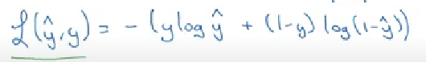
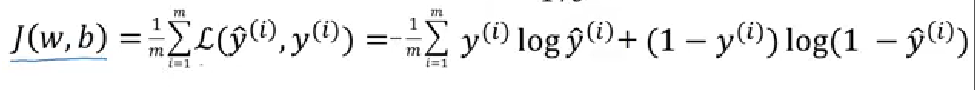
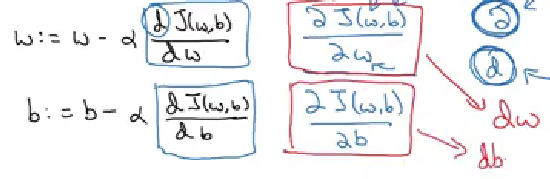
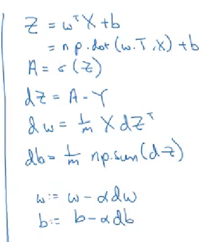
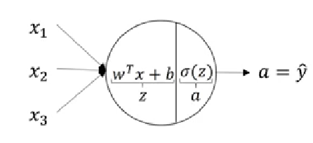
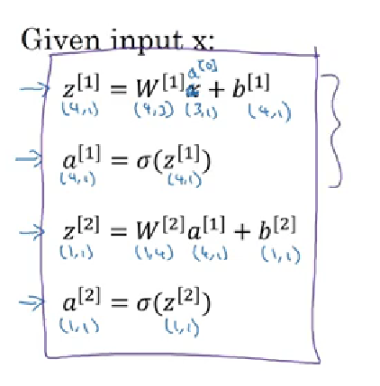
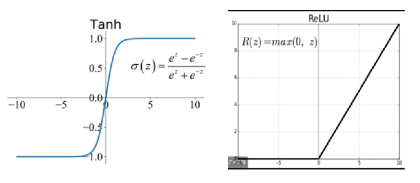
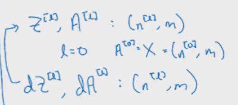
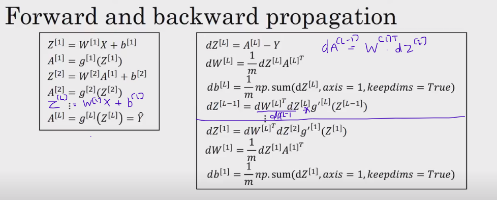
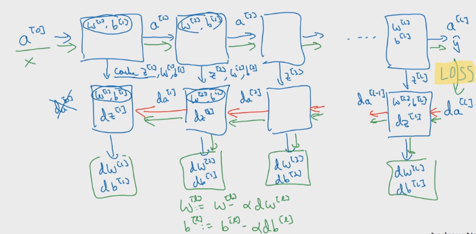

# DEEP LEARNING 
# COURSE 1 -
## WEEK 1-
**Introduction to deep learning and neural network**

* A single neuron takes some input and gives an output and many neurons stacked together form a neural network

* Supervised learning – uses neural network where input x and output y are both given and model is trained to predict y for some x

* Different neural networks –
Standard NN, Convolutional NN ( image processing ), Recurrent NN ( sequential data like time series, audio,etc ), Hybrid NN

* Types of data-
Structured data- each feature has a well defined meaning with labels 
Unstructured data – raw audio, images not well defined structure

* Performance of a NN increase with increase in amount of data. Scaling of data and parameters has improved deep learning by improving computation and size of NN

## WEEK 2-
**Basics of neural network programming**

We will learn :
-forward and backward propagation
-eliminating the use of for loops for neural networks

### LOGISTIC REGRESSION -

_NOTATIONS -_

* (x_i,y_i) – i ranges from 1 to m
* x is called feature y is the label
* can be a vector with n_x parameters
* Logistic regression is used for classification ie y can be either 0 or 1

* m -> no. of training examples  
* X is a matrix of size (n_x,m)
* Y is a matrix of shape (1,m)
* y^ is predicted output = P(y=1|x)

_SIGMOID FUNCTION –_

* We need sigmoid to give a value between 0 and 1 since z by itself can be any value

 
_LOSS FUNCTION – L_

* Measures how good y^ is as compared to y 
* So this ensures loss is minimum for both y=0 and y=1 when y^ is a good prediction ( ie close to y)

_COST FUNCTION – J_

* Loss function was for single training example , cost is for entire training set
* It is a convex function with only 1 global minima 

_GRADIENT DESCENT -_

* It helps us find w and b that minimize the cost function J ( ie give y^ almost close to y) through backpropagation
* We update w and b in every iteration using below function and determine cost after every iteration until it becomes say minimum

_COMPUTATION GRAPHS –_

* Computation involves -
Forward propagation to compute output of a neural network followed by backpropogation which changes w and b using gradient descent

_VECTORIZATION –_

* Using np.dot to multiply two vectors instead of using for loop reduces computation time and is useful for large datasets.
* Both GPU and CPU have parallel instructions – SIMD which works in case of dot product 

_BROADCASTING –_

* Using this we can resize vectors/scalars to give a shape appropriate for performing arithmetic operations with other matrices. 
* For (m,n) + (1,n) -> the (1,n) resizes to (m,n) 
* For (m,n) + k -> k changes to (m,1) with all m values as k 

## WEEK 3

IMPLEMENTATION AND REPRESENTATION OF NEURAL NETWORKS ( 1 hidden layer )

_NEURAL NETWORK REPRESENTATION –_

* We represent different layers in neural network using superscript [n]
* Different nodes is a layer are represented by subscript 
* Hidden layer values are not seen in the training set
* a refers to activation ie the output that each layer passes on to the next
* a[n] is output of layer n
* 2 layer NN is a NN with one hidden layer 

For every node -

* We then combine corresponding values of each node in a layer in a vector stacked vertically for all z,w,b,a
 
Vector representation for 1 training example -

Vectorizing for m training examples -

* Horizontal traversal of a vector goes to next training example
* Vertical traversal goes to next hidden unit 

_ACTIVATION FUNCTIONS -_

* Hidden layers – tanh since its mean is around 0 which helps centre data around 0 ( unlike sigmoid)
* Final layer – sigmoid if we want binary classification (0 or 1)

* Drawback of tanh-
For very small or large z , slope->0 and hence gradient descent becomes very slow

* Overcome using ReLU (Rectify Linear Unit)

Need of activation :

* With a linear or no activation functions the hidden layers will give linear outputs only and hence we are discrediting the use of neural network . Its no better than a simple logistic regression.

Derivatives of activation functions :

* Sigmoid- g’(z) = g(z)(1-g(z))
* Tanh -  g’(z) = 1-(g(z))2
For large and small z , slope ->0
* ReLU = g’(z) = 0 if z<0 and 1 if z>=0

_INITIALIZING WEIGHTS –_

* If weight matrix of size ( n[1],n[0]) is initialzed to 0 , all nodes in a layer will end up performing the same function no matter how deep it is 
* Bias can be 0 
* So we initialize parameters randomly 
* W[1] = np.random.randn(n[0],n[1]) * 0.01
* 0.01 and not large value since otherwise Z will become too large and problem of slope->0 for activation fn occurs

## WEEK 4

DEEP NEURAL NETWORKS - with more hidden layers 

_NOTATIONS-_

* L = no. of layers ( hidden + output )
* n[l] is no. of nodes in lth layer
* a[l] is no. of activations in lth layer , a[l]= g[l](z[l])
* w[l] and b[l] are weights for z[l] 
* a[L] is y^

_MATRIX DIMENSIONS -_

* For 1 training example :

* For m training examples :

_DEEP NN-_

* They are required to detect images or speech to text as they require several intermediate learnings 
* a shallow NN would require more nodes as compared to deep NN for the same function

_FORWARD AND BACKPROPAGATION-_

* Overall formulas -

* Flowchart -

_PARAMETERS AND HYPERPARAMETERS -_

* Parameters - w[1], b[1], etc
* Hyperparameters - learning rate(alpha), iterations , no. of layers , hidden units, activation fn -> they determine the parameters 
* choose alpha that converges the cost fn, ie eventually reduces it to near 0 

