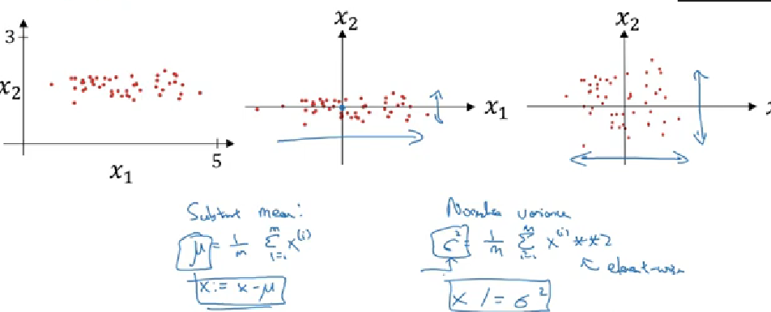
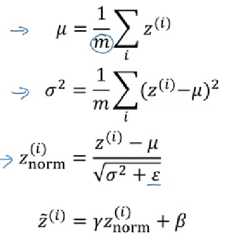

## WEEK 1-

Learned - Bias/variance, regularization, normalization, grad checking, vanishing/exploding gradients

- Divide data into Train , dev and test set 
- On dev set we evaluate algorithms and choose the best so it can be much smaller % for larger dataset
- Avoid mismatch in train and dev/test by choosing all 3 from the same distribution
- Not having a test set works

_BIAS AND VARIANCE-_

- High bias - when training set error is a lot compared to human error
- Solved by- bigger network/training for a longer time
- High variance - leads to overfitting and is due to error between training and dev 
- Solved by - more data/regularization 

_REGULARIZATION-_

L2 REGULARIZATION -

- Applying regularing for a single parameter changes the cost fn to-

- Appyling on a neural network -
Also the derivatives for backpropogation change 

- L2 norm is also called weight decay since the change in w during gradient descent becomes more 
w = w(1-alpha*lambda/m)-(usual backprop term)

How regularization prevents overfitting -
- It redcues the value of w in every backprop step ( not necesarry w~0) and hence reduces impact of several hidden units thus simplifying the NN 
- increasing lambda decreases w hence reduces z so the tan h function reduces just to the central linear part , and a linear would always give a linear output so prevents a non-linear curvy decision boundary as in overfitting

DROPOUT REGULARIZATION -

- We drop some nodes in each layer for each training example so the next layer cant rely too much on a particular node so the weights spread out

- So here , for every node in layer l we randomly assign 1 and 0 ( 1 if prob>keep prob) and then change a3 by multiplying it with d3 which zeroes out some values 
But this tends to reduce z by 20% hence to compensate we divide a3 by 0.8 before using it 

- NOT TO USE DROPOUT DURING TEST 

- Now w[l]has dimension (a[l-1],a[l]) so the layer having the maximum elements in the w matrix can have a lower keep probabilty , and input layer should have very high keep prob

- Drawback -
Double checking gd isnt proper since cost function changes every time due to dropping of different nodes 

- So we can turn off dropout, check if J is monoonically dec and if so then turn on drop out

DATA AUGMENTATION-

- We increase the size of training set by flipping, cropping or distorting the image 

EARLY STOPPING -

- As we run gd and plot cost fn vs iterations, we also plot it for the dev set error and take the value of w where dev set error starts diverging

*NORMALIZING INPUTS-*

Perform these steps -

- Use the same mew and sigma of train on the test set 

- We need this since if we have x1 from 1...1000 and x2 from 1..10 then w1 and w2 will take very different vlues leading to an elongated contour plot of w's which would require a very small learning rate to converge to the minimum 

*VANISHING/EXPLODING GRADIENTS-*

- If w is much greater or smaller than 1 then it will exponentially increase or decrease as we proceed which will need to vanising or exploding gradients

SOLVING THE ISSUE-

- n[l-1] is the feature the lth layer gets as input so this ensures value of w is close to 1 , not too high or low

*DERIVATIVE COMPUTATION-*

- f(θ+ε)-f(θ-ε) / 2ε

*GRADIENT CHECKING-*

- To check if back prop applied in correct , take each ith w and b into a giant vector θ_i and combine all thetas into θ; dw's and db into dθ ; so J becomes a fn of θ

- so we compare dθ_approx[i] (using derivative computation) with dθ[i] (ie dJ/dθ)
by computing the euclidian distance and if the result is close to ε, the back prop performed doesnt have bugs 

- used only to debug but not in training 

## WEEK 2 -

Types of gd - mini batch, exponentially weighted avg, momentum, RMSProp, Adam optimization, Learning rate decay

*MINI BATCH GRADIENT DESCENT-*

- Instead of processing the entire training set for every step of gd we can use mini batches

- mini batch t = X{t}, Y{t}
- dimension of X^t is (n_x,size of batch) and y^t is (1,size)

- Epoch means a single pass through the training set
1 epoch in batch gd ->  takes only 1 gd
1 epoch in mini batch gd -> multiple gd's

- If mini batch size=1 it is called stochastic gd -> it doesnt really converge

- We take a mini batch size between 1 and m -> good vectorization + progress w/o processing entire training set

- If m<=2000, take mini batch in powers of 2 from 64 to 512

*EXPONENTIALLY WEIGHTED AVERAGES-*

vt = βvt-t + (1-β)θt

Vt is approximately averaging over 1/1-β previous records

- While coding , instead of keeping too many v's we just keep one v and keep updating it , it reduces memory occupied and computation

*BIAS CORRECTION -* not really used

- For initial data points, due to 1-b being too small , the v's are incorrect
- To go from incorrect purple to green line ,  we divide Vt by 1-β and that gives a correct value 
- For higher t's bias correction becomes negligible

*GRADIENT DESCENT WITH MOMENTUM-*

- We compute exponentially weighted avg of the gradients and then use that to update the weights, this speeds up the process

- In above img, we want lesser momentum in vertical direction in the image and more in horizontal

- So if we have big vertical oscialltions initially, the exp weighted avg i vertical becomes 0 and hence reduced vertical osc whereas horizontal increase

- Usually β=0.9 is a good value

*RMSProp-*

- So here as we see it is more steep in vertical direction so db would be large (considering b as vertical parameter) and dw will be small which will in turn lead to larger changes in w and smaller in b which does our job 

- Also we add ε in Denominator to prevent too much overshooting if Sdw~0

*ADAM OPTIMIZATION ALGORITHM -*

- It combines momentum and rms prop and applies bias correction 

Hyperparameters-

alpha = to be tuned 
β1 = 0.9
β2 = 0.999
ε = 10^-9

*LEARNING RATE DECAY-*

- Reduce the learning rate over time in mini batch gd

- So if batches are small there is a lot of noise and oscilaations and it doesnt really coverge 
- Now if we reduce learning rate over time , in the end it will take smaller steps and oscillate in a tighter region around the centre

- 2 additional hyperparameters decay-rate, α0 to be experimented and α reduced in each epoch

or

or just manually decay 

##  WEEK 3 -

Learned - Tuning hyperparameters, normalizing activations (batch normalization), softmax refression, tensorflow

*IMPORTANCE OF TUNING HYPERPARAMETERS-*

- Order of importance-
alpha
beta , hidden units, mini bacth size
layers, learning rate decay
epsilon

- So for a uniform choosing bw 0.0001 and 1 we find a and b by taking log of extremes, then choose a ranodm value bw a and b and raise 10^ to that to give alpha

- β is from 0.9 to 0.999, 1-β is hence 0.1 to 0.001 and so use the same method above 

Keep re-testing hyperparameters 

- Either baby-sit a model so plot cost fn and keep checking it at some intervals, if it every goes upward, take the alpha of previous interval 

- Or train many models in parallel

*NORMALIZING ACTIVATION -*

- Dont just normalize initial inputs but also the activations which act as inputs within the layers

- We will normalize z[l] instead of a[l] ie before activation

FOR A SNGLE HIDDEN LAYER -

- This gives mean=0 and sd=1 which we dont always want so we introduce gamma and beta

FOR A NEURAL NETWORK -

- For each layer, find x -> z -> z with normalization ( governed by beta and gamma) -> a which acts as x for the next layer

FURTHER USING MINI BATCHES -

- we dont really need b since when i do z-mew i am cancelling out b

- So for each mini batch compute forward prop as mentioned above for a neural network  and then compute dw's and db's to do back prop. Here we can implement any form of gd - exponentially weigjted avg, adam, momentum by just using their respective back prop fns 

WHY DOES BATCH NORM WORK -

- Covariate shift for a X->Y mapping is when distribution of x changes but groud fn remains same , we might need to retrain the model ( as in black and non-black cats)

- So what happens is that batch norm makes each layer learn more independently from other layers
say i consider layer 3 , then its input a's depend on the previous layers but batch norm ensured that whatever the change is , the mean and variance will remain the same thus making them more stable and hence affect the later layers less 

- Each mini bacth is scaled by mean and var of that batch which adds some noise of z[l] which can be reduced by increasing the batch size which sometimes has a regularization effect 

BATCH NORM AT TEST TIME -

- During training, we are getting t mew's and sigma's for each layer ( t is batch size) but we dont have these many batches at test time
- So we compute the exponentially weighted avg of mew's and sigma's for each layer during train and use that for test 

*SOFTMAX REGRESSION -*
 
- It generalizes logistic regression to multiple classes; softmax layer is applied only in the last layer

- If we have c clases the output vector y would be a (c,1) vector each value denoting prob of a class

Activation function -

)

- So instead of binary class where final output was a real no. here it is a vector

- If you plot graph for x1 vs x2 vs... the decision boundaries will be linear 

Loss function -

- Y and Y^ are both (c,m) dimensional vectors, c being no. of classes , Y has only 0's and 1 for each m

*LOCAL OPTIMA -*

Gd is unlikely to be stuck on a local optima as its actually a saddle point where derivative can be 0 not really a local optima

Plateau can slow down learning as it is a region where derivative is close to 0 for a long time

*TENSORFLOW-*

Deep learning programming framework

- We have to implement only forward prop , it automatically does the back prop

- If you want to use a different gd say Adam optimization, just change the gradient descent optimizer line