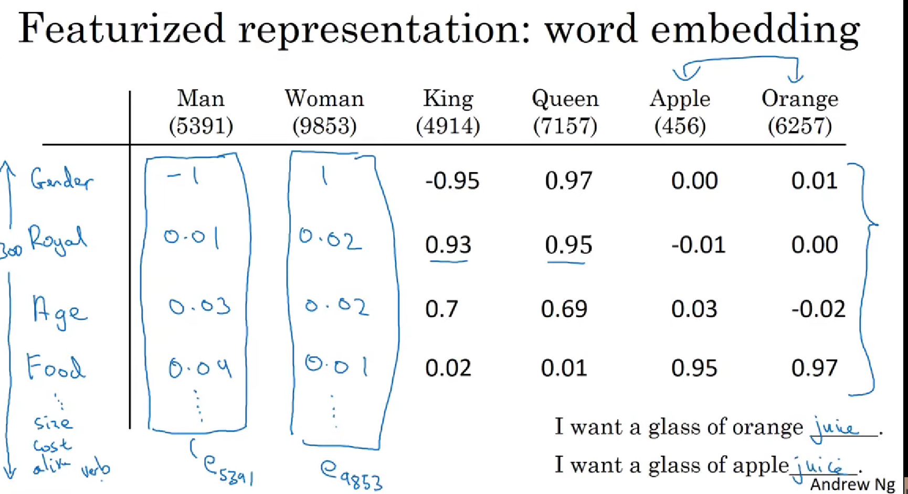
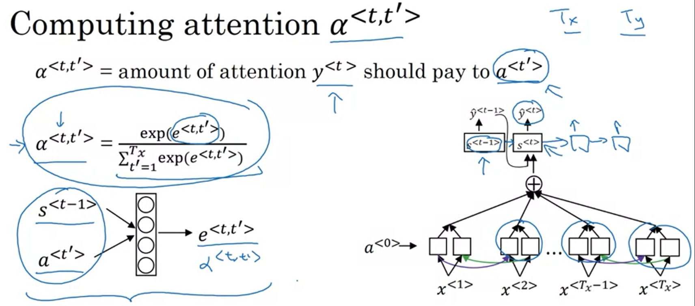

# COURSE 5
## WEEK 1-

Sequence data is used in speech recognition, sentiment classifcation, name entity recognition , etc 

*NOTATION-*

x(i)<t> is the t th element ( maybe t th word) of ith input data
y(i)<t> is the t th element ( maybe t th word) of ith output data
Tx(i) is the length of ith input 
Ty(i) is the length of ith output

We create our vocabulary (30k to 50k) based on dictionary order of words ( here 10k)
- by either looking up top 10k words in training set or english language 
- the vector corresponding to each word will be a (10k,1) vector with '1' in the position of the word, all other '0' 
  
Disadvnatges of using a standard NN for this-
- ip/op can be of different length 
- doesnt share features learned across diff positions
- the input layer will be a very large matrix with many parameters

*RNN-*

- We will consider an example in which input is a sentence and we need to implement name entity recognition
- output will be a vector of length as no. of words which each value being 1 or 0 if its a name or not

- Also Tx = Ty here

- wax means w is multiplied by some X to give some a like quantity
- activation is usually tanh fn

SIMPLIFIED VECTOR NOTATIONS-

- For each training data i , parameters will remain same for each time step

*BACKPROPOGATION-*

LOSS FUNCTION -

*TYPES OF RNN-*

*LANGUAGE MODELLING WITH RNN-*

WORD LEVEL MODEL -

TRAINING -
- Take a large corpus of training set
- Tokenize it ( possibly one hot vector using a vocabulary) ( <EOS> also can be used )
- If a word is not in vocab give it the <unk> token 

- Each layer has its input as the previous layer's output
- Every layer is a softmax layer performing a 10k ( in our case) way classifcation determines the probability of it being each word in the vocab 
- So every intermediate output is the prob of it being any word in the vocab given the previous n words

- Next is the cost fnction which is same as classifcation

MODEL-
- Finally the model will be able to predict a sentence given the intitial few words
- The prediction depends on thr product of probabilities of intermediate y's

*SAMPLING NOVEL SEQUENCES-*

TRAINING- 
- A sequence model , models the chance of any particular seqeucen of words ( P(y<1>,y<2>,etc)) 
- While training we teach it to predict the next text by providing a large corpus and making it learn patterns by having multiple iterations

SAMPLING-
- We first sample what is the first word we want the model to generate , here input X<1> =0
- The softmax layer gives a word with max chance as y^<1>
- In the second time step we take that word we just sampled and pass as input to 2nd time step and it goes on
- To end it we either keep going till it samples a <EOS> token or have a fixed number of say 20 words

-----

CHARACTER LEVEL LANGUAGE MODEL -

- Vocabulary is [a,b,c..z,.,!, etc]
- So to predict "cat" it goes on like 'c'->'a'->'t'
- It does remove the issue of <unk> words but..
- There are manyyy charcters to it doesnt have long range dependencies
- Also more computation required

*VANISHING GRADIENT PROBLEM-*

- a word very eary in the sequence can affect later words( cat,cats->was,were) but for a large model it would be difficult to identify it by backpropagating to very beginning due to vanishing gradients 

(Exploding gradients : can also occur and apply gradient clipping by reducing gradient to below a threshold )

*GRU -  GATED RECURRENT UNITS *

- c is value of memeory cell
- c~ is a candidate for replacing c
- a is activation value 
- a=c in GRU ( but not in LSTM)
- gamma gate u (update)is usually 0 or 1 because of the nature of the sigmoid fn
- gamma gate r (relevance) determines how relevant is c<t-1> for calculating c<t>~

PROCESS-
- so first say i saw cat then gate will decide to set c to 1 ( cosidering 1 is for singular)
- then the gate remains 0 until 'was' so that c<t>=c<t-1> till there
- at was it realizes ok this is where the c value matters, it sees c=1 so sets it 'was' not 'were' and then c is again reset

*LSTM - better than GRU* 

- here a<t>!=c<t>
- there is no relevance gate
- there is a forget gate and output gate

*BIDIRECTIONAL RNN -*

for words like "teddy" we cant say whether to use was or were .. since it matters if it is bears or roosevelt
hence we need a reverse units

- both forward and backward sequence comprise the forward prop
  

- bidirectional RNN with LSTM blocks is fairly popular

- CONS- it requires all info prior.. so for speech recog u need the person to finish the speech before recognition not real-time

*DEEP RNN'S -*

- multiple layers, usually 3 are sufficient
- moreover, the outputs can have a couple of another layers individually 

## WEEK 2 -

*WORD EMBEDDINGS-*

- we need them since the vone hot vectors dont really represent any relation between words, inner product of any two one hot vectors is zero so even that cant be used
- so we take certain say N parameters and create word embeddings for each word in the vocab which will then represent two similar words

- to represent this N features embeddings into a 2D space using T-SNE 
  

LEARNING WORD EMBEDDINGS -

*ANALOGIES-*

- eman-woman=eking -ew ( since their word emb vector diff would be similar)
- We need to find the max similarity (ew,eking-eman+woman)

*MEBEDDING MATRIX -*

- multipyinf the E matrix with one hot vector of a word gives the E matrix coloumn of that word
- in practice we wont use the multiplication method

*NEURAL LANGUAGE MODEL-*

- we first have one hot vectors for each word  in the input sentence
- that is multipled by E matrix to give embedding vectors e for each word
- they are then passed through a neural network with w1,b1 parameters
- that is then passed through softmax layer which decides 1 out of 10k words in our vocab with w2,b2
- we can then d back prop and repeat

- also  another hyperparmeter can be added to consider only the last n words for the next word prediction instead of the whole sentence 

- context can be anything, last n words, n words on right and left, nearby 1 word, etc.

*SKIP GRAMS -*

- the context and target word can be any no. of words apart

- theta t is parameter associated with the target word 
- it determines the probability of the target word givne the context word

- but the denominator is usually too long to compute for a larger vocab

- so we use a hierarchical softmax classifier which keeps diving words in half based on which half the target word would be in .. using a two way classifcation

Samping of context c is sampling (ie techniques to determine the next word preiction) over the no. of words taken for context 

NEGATIVE SAMPLING -

training model -
- X : context , word
- Y : target
- we take k random words from the vocab and determine target as 0 or 1 based on if the word relates to the context
- if the word can be btained by sampling it close to the context word then it is given 1
- k is taken as 2 to 5-20 for smaller dataset ; 2-5 for larger datasets
- k:1 negative to positive ratio

- so instead of having 1 10000 way softmax we turn it into 10000 binary classifications and implement k+1 classification models in each iteration , chossing different negative samples in each iteration

- Probability of choosing negative words from the vocab 

*GLOVE ALGORITHM -*

- Xij is how many times j appears in context of i, i is context word, j is target

*SENTIMENT CLASSIFCATIO -*

- It involves identifying and classifying emotions , such as rating a restaurant based on customer reveiw

- consider the sentence " Completely lacking in good ambience and good taste"

- a general model is to take one hot vectors of each word, multiply with E and get embedding vectors for each, take their avg and form a 300 dim vector and pass that through softmax of 1-5 for rating
- but here it gives higher importsnce to word "good" which appears more and hence doesnt perform well

- SOLUTION- to pass the e's into RNN blocks and form a many to one RNN which will take sequence into account and hence the word "lacking" will be considered 
- 

*DEBIASING WORD EMBEDDINGS -*

- The network could learn father:doctor and mother:nurse which can reflect gender, ethnicty,etc bias of the text used to train it

- 

## WEEK 3-

*SEQUENCE TO SEQUENCE MODELS-*

Consider french->english translation

- we take encoder-decoder :
- encoder finds a vector encoding of input senetnce and decoder generate the english sent

- the ml model predicts the output conditioned on the input sentence
- it takes an encoded form of ip sentence as input of decoder instead of a vector of 0's as in a langugae model

- in sentence prediction we would choose a random probabilty instead of max to get variations but in langauge translation we need to get the most like translation

- but pikcing the best word one after another doesnt really work

BEAM SEARCH ALGORITHM-

- Pass the input french senetcne through the encoderb
- Set a beam width say B ( which means it will keep a track of  most probable words at every time step)
- For each of the B, find probabilities of all words in vocab the next word in next time step
- Then multiply p(y1)p(y2) so we will have B*vocabsize choices for 1st two words and we consider the top 3
- we repeat it for B th layer by hardwiring the 1st two words
  
LENGTH NORMALIZATION-

- we consider log of above probabilities to prevent numerical underflow in case of very small p
  

- We find the max of this Normalized log likelihood objective 

- large B -> better but slower results 
- small B -> worse but faster

*ERROR AMALYSIS-*

BEAM SEARCH might not always give the correct op
- y* is predicted output and y^ is actual
- P(y*|X) > P(y^|x) it means there is a fault in beam search as it couldnt give the one with max prob
- Else maybe the RNN Model has error and regularization/more data can help

*ATTENTION MODEL -*

- As the sentence becomes longer the prediction correctness reduces as it can rememeber long sequences 
  

Consider a bidirection RNN/LSTM-
alpha determines the weight given to each word for the current word prediction  

 
- s is hidden state ie basically the activation of the 2nd RNN 

*SPEECH RECOGNITION -*

- An attention model can be used 
- CTC Cost :
- We use a model with equal no of inputs and outputs 
- but in speech recog, the number of ip time steps is much bigger 
- a 10s of audio can have 1000 inputs so for 1000 charcters in alphabter , the CTC cost fn alows to have many blank charcters in the output
- the ctc cost fn will collapse it

*TRIGGER WORD DETECTION -*

- like saying 'alexa' to activate it
- To train it say we have input fatures x<t> for every time step based on an audio clip.. every time the trigger word comes up we can have the output to stay 1 for some time and revert it to 0 later

## WEEK 4-

*TRANSFORMERS -*

- Entire sequence can be processed in parallel as opposed to LSTM,GRU,RNN where one word had to be processed at a time

- Attention + CNN style of processing

SELF ATTENTION -

1. Calculate attention based vector representation for each word A(q,K,V) [ A<1>, ...] ( similar to alpha in attention model)

2. For each word, Q<t> is a query and K comapres the query with all other words to find the ost suitable k<t> for that query, V gives us how Key should be represented with the query

MULTI-HEAD ATTENTION -

1. It is a for loop over the self attention
2. We take W1Q W1K W1V for the first head and have a query1
3. For the second head we take W2 and it represents another query and finds the most likely key accordingly
4. h = no. of heads
6. We can compute all heads in parallel ( in most cases no need of for loop)

POSITIONAL ENCODING -

1. It is added ti the input vectors to give an idea of the sequence of words 
2. each word is assosiated with a vector p<Tx>
3. d is dimension of P , pos = 1 for first word
4. say d=4 : for first two i=0 then i=1 beacuse we use two functions sin and cos
5. fn for i=1 is of higher freq     

ENCODER -

- The output contains contextual semantic embedding and positional encoding info
- Masked multi head attention allows the training to mimic test by masking some of the words ( since at training we have the complete translation availabe but at test we dont )
- Hence it gets trained to predic t the next words accurately