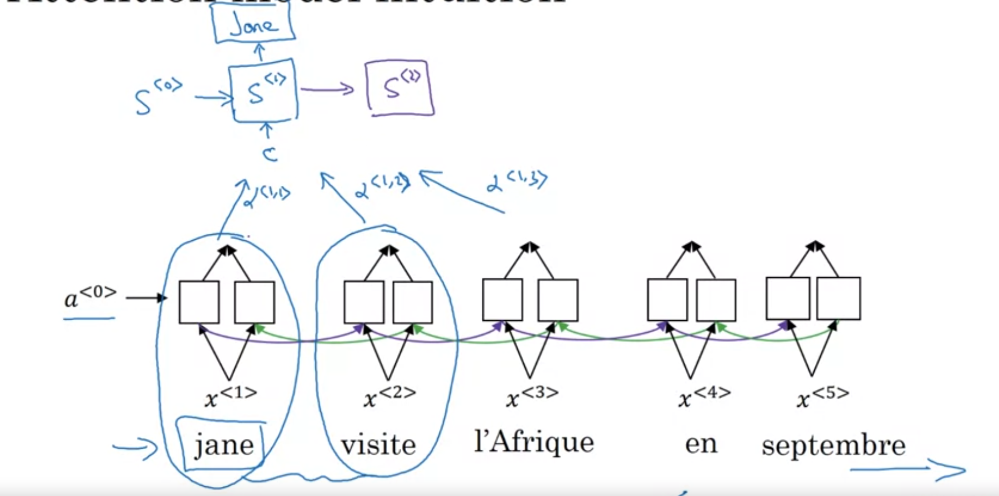
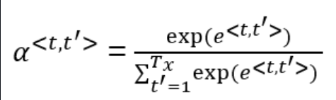
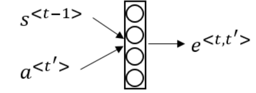
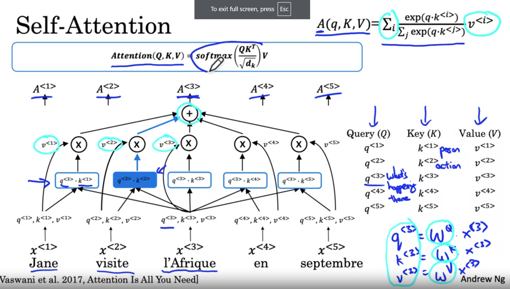
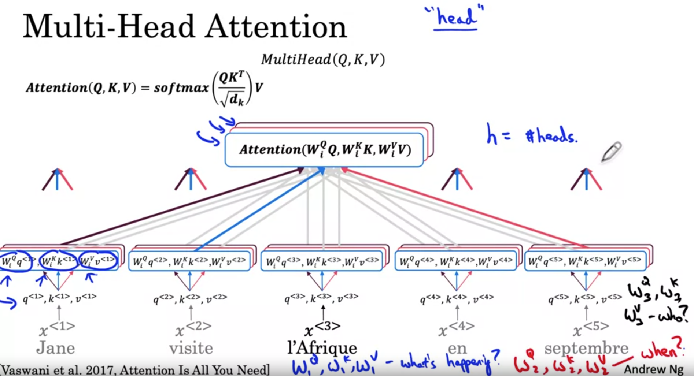
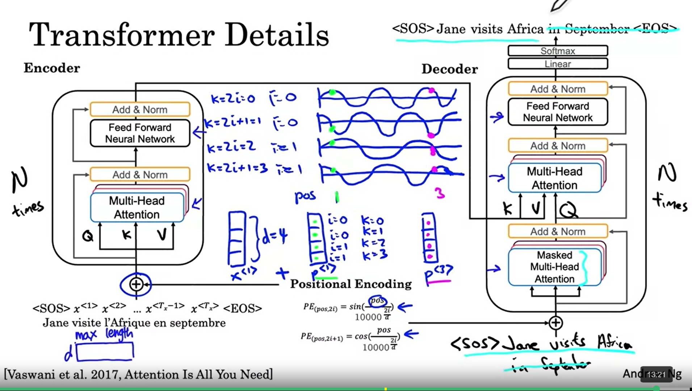
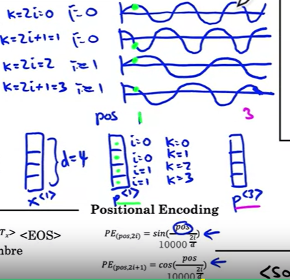

***
# Notes 01-08-24

## Week 3 & 4 Course 5

### Machine Translation

* For Machine Translation we can utilize Many tom Many LSTM architecture with an encoder and decoder network. Unlike Language model, Machine Translatiom model should sample random output as it would require the best output.
* We cannot go with a greedy search approach as it does not work well on Machine Translation. Greedy Search would give the bes prediction of the next word in enxt sequence however we need the probabilty of the whole sequence to be best which is not neccesary with this approach
***
### Beam Search
* Thus, we utilize beam search approach wherein first we pick the most probable 'n'(beam width) output and then calculate the conditional probability of the next sequence for this 'n' output and again pick the n most porbable output.
* One of the problens with this is that while mutliplying probabilities which are small fractions can cause numerical overflow. Thus, instead of directly multiplying the probabilities we sum up the the log of that. 
* But this causes preferenes to shorter sentences. Thus to remove this bias we divide it by length ofthe sequence.Usually, it is also rasied to power (alpha)
* In practice the size of beam search is of usally 10. However, size of 100 or 1000 is not uncommon.
* Error in a machine Translatiom model can be because of two reason : RNN or Beam Search. Thus, to identify what we need to optimize we should first calculate the the output probability of both the correct sequence and the the output that we have got. 
* If probability of correct sentence is more it implies RNN is not at fault, thus we need to increase beam width. Else, the RNNmodel is at fault and we need to som changes in our model.
***
### Attention Model
* For Machine Translation, we were using an eoncdoer decoer which first takes in all the sequence and then starts with output, However, for long sentences a human translator would first maybe trans;ate first few words and then the next few words and so on. 

* Suppose we have a BDRNN which has input sequence,and another RNN which is a decoder block, now for predicting the first wourd of output we will sum up the alpha(which represents the attention) of every timestamp to get a context for first word of output.
 

***
###  Self and Multi-Head Attention

* For Self Attention we first we first create three matrix Query(Q), Key(K) and Value(V). For each word these are created by multiplying weight Wq, Wk, Wv with input words to form q , k and v repsectively. 
* Now, for each word we will multiply it's query with key of every other word, and perform softmax on that and multiply that with value(V) to get attention of that word

* For Multi-Head Atttention we use multiple weights for key, query and value thus using multi head the model answers different question 

***

### Transformer Networks

*  For Transformer Network, we will use a encoder block which has a multi head self attention layer and it's output is fed into FeedForward Neural Network which and this block is repeated for 'n' times( mostly 6) and then for decoder network we pass the first token mostly <'SOS'> to the decoder nwtwork which acts as Q for decoder block which gets K and V from the output of encoder block and then the output of this multi head attention is passed to another FeedForward Block.
* The decoder block is also repeated N times and a linear and softmax layer is added to get a final output.

* Uptill now, there is nothing that has been done to acknowledge the sequence of the words, thus we add a positional encoding to the input before the encoder block. 
* THe positional encoding is calculated with help of this figure  

