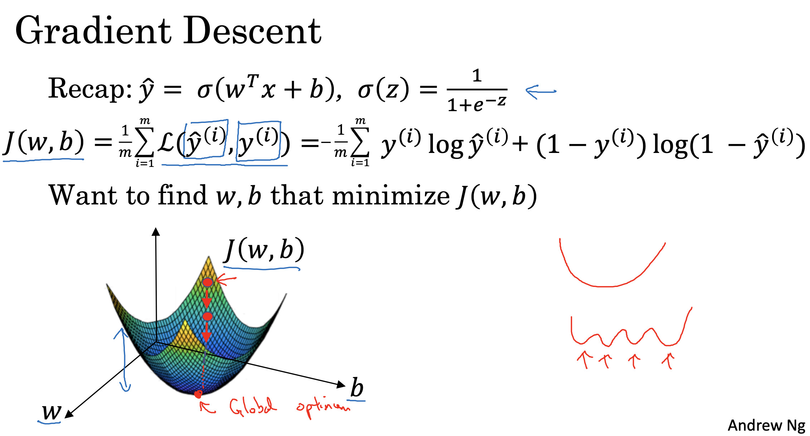
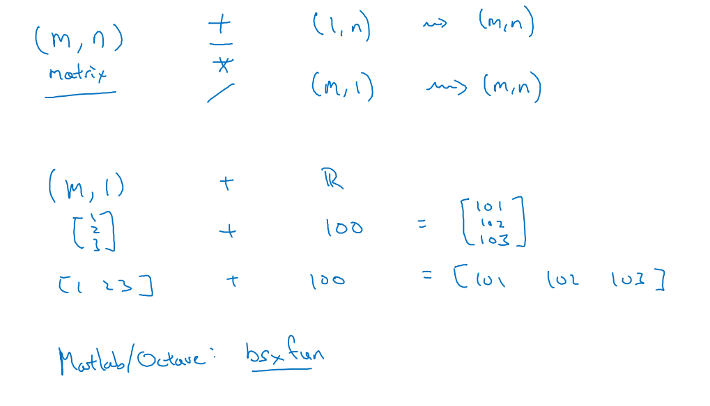

***

# Notes 18-07-24

## Week 2 Course 1

### Logistic Regression

* Logistic Regression is an algorithm used when output y is either 1 or zero for all training examples.

* Logistic Regression gives the probability of output being 1 given that input is x. Mathematically,  
 𝐺𝑖𝑣𝑒𝑛 𝑥 , 𝑦̂ = 𝑃(𝑦 = 1|𝑥), where 0 ≤ 𝑦̂ ≤ 1
                        
* For bounding the function between (0,1) the linear function (ax + b) is passed through a sigmoid function which gives the probability between (0,1). In given images z represents the linear function.

#### Cost Function for Logistic Regression

* The loss function measures the discrepancy between the prediction (𝑦̂) and the desired output (𝑦), while cost function is the average of the loss function of the entire training set.

* For Logistic Regresssion, cost function is defined as:  

$J(w, b) = \frac{1}{m} \sum_{i=1}^{m} L(\hat{y}^{(i)}, y^{(i)}) = -\frac{1}{m} \sum_{i=1}^{m} \left[ y^{(i)} \log(\hat{y}^{(i)}) + (1 - y^{(i)}) \log(1 - \hat{y}^{(i)}) \right]$

* This cost function is used to tune the parameters to get better and accurate at predictions. This can be done using Gradient Descent Algorithm:  

***

### Vectorization

*  Vectorization is a way by which we can avoid applying for loops. Thus it saves time as it utilizes parallelization technique(SIMD)
* Vectorixation can save time in computing sigmoid function, applying gradient descent algorithm

***

### Broadcasting
*  Broadcasting describes how NumPy treats array with different shapes during arithematic operations. The General rule of broadcasting is given in diagram 

***

