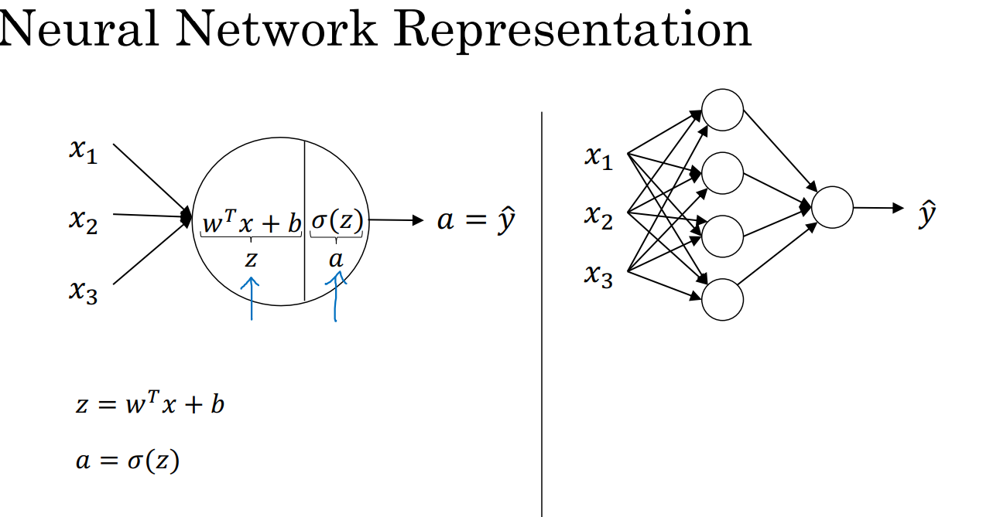
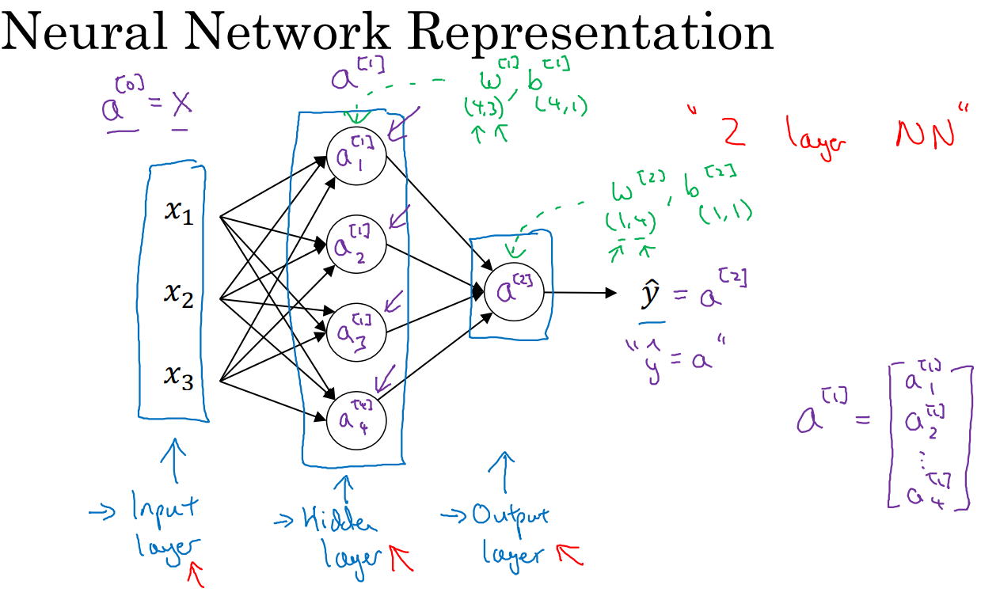
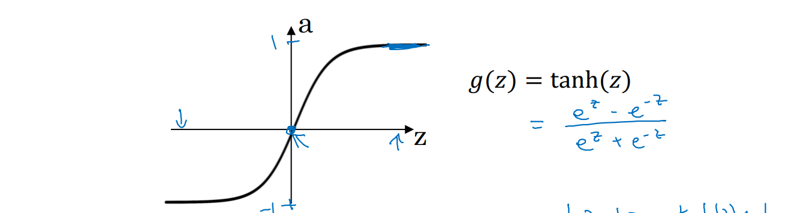
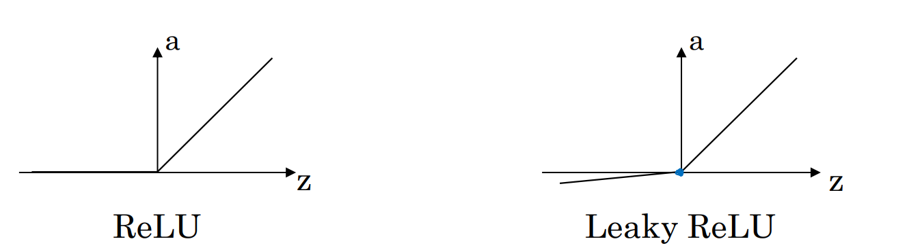

***

# Notes 19-07-24

## Week 3 Course 1

### Neural Networks

* We had previously defined Logistic Regression, in this course we can understand Neural Networks as stack of logistic regression cells
  

* Neural Networks usually consist of a input layer , 'n' number of hidden layer and one output layer.  
The following diagram illustrates a NN with one hidden layer and writing conventions where superscript represents the layer number and subscript represents the neuron in that layer
  

* Vectorized Implementation of the forward pass and backward pass is important to make the process faster through parallel processing.

***
### Activation Functions  
* The Problem with sigmoid activation function is Vanishing Gradient. The function sometimes return small values thus weight update through gradient descent becomes a problem.  
* To solve this problem we use tanh activation function(which is a shifted version of sigmoid activation function and is centered at origin) however still the problm of vanishing gradient persists when output is near zero.
  

* Other activation functions include ReLU(Rectified Linear Unit) and leaky ReLU. ReLU is defined as    max(0,z). Leaky ReLU is slightly different from ReLU as when input is negative it has a small slope(~0.01)

***
### Need for Non-Linear Activation Function and Random Initialization

*  If we form a NN of linear activations, than it is evenetually just being a linear function with some weight and bias and and won't be able to solve problems when dependency is non-linear
* However, Linear activation functions can be used in the output layer if it is regression problem or we have to predict a number (e.g. Prices of House)
* We cannot initilaize all weights in a NN to zero as then it all layers will compute same output and have the same gradient and symmetry cannot be broken.
* Also weights should be initialized to small values as if the output of hidden layers are large then non linear activation functions like tanh and sigmoid will saaturate(give 1 as output).

***