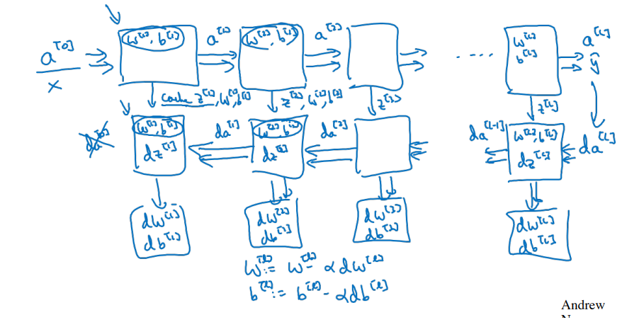

***
# Notes 21-07-24

## Week 4 Course 1

### Deep Neural Networks

* The neural networks till now have either one or two hidden layers. A neural networks with more hidden layers is a deep neural network.  
*  A logistic regression cell can be considered shallow with respect to NN with one or two hidden layers which in turn is shallow with respect to NN with more hidden layers which are deep neural networks.

***

### Why we need Deep Neural Networks?

* In a Deep NN, every hidden layer of NN tries to make a relation with previous layers and identify different aspects or relations of input. For example in a Face Recoginition System the first layer might be analysing the edges of image, second layer the parts of face and the third layer the whole face.
* According to the circuit theory, for every small deep neural networks we can can use a shallower neural netorks with exponentially more hidden units to compute thus taking more time.

***

### Forward Propagation and Backward Propagation

* Deep NN is around these two processes which are it's building block. Every layer undergoes a forward pass using weights(w) and bias(b) keeps the the output of activation functions (Z & A) in cache and in a backward pass caclculate the dW and db to compute gradient descent

***

### Parameters and Hyper Parameters

* Paramters of a Neural Network is usually it's weights and biases while the hyperparameters are which control the parameters or the model which includes learning rate, number of iterations, hidden units, hidden layers, etc.
* The hyper parameters optimizes the performance of model and the value of hyperparameters can determined empirically i.e. experimenting with different values of hyperparameters