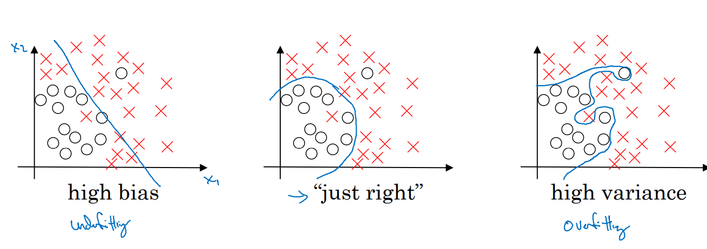
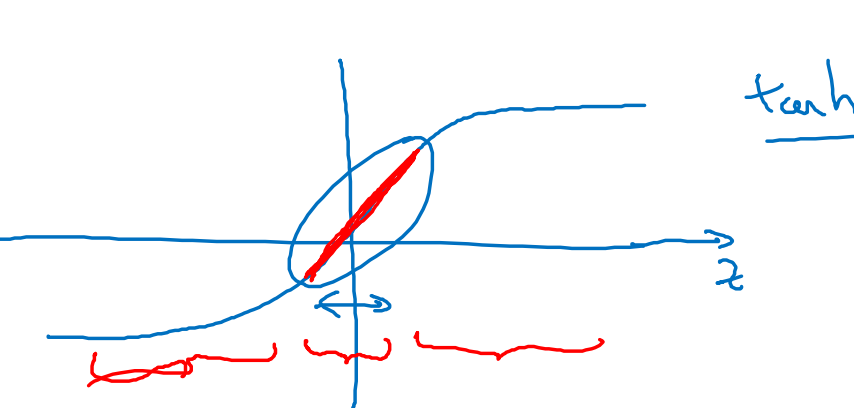
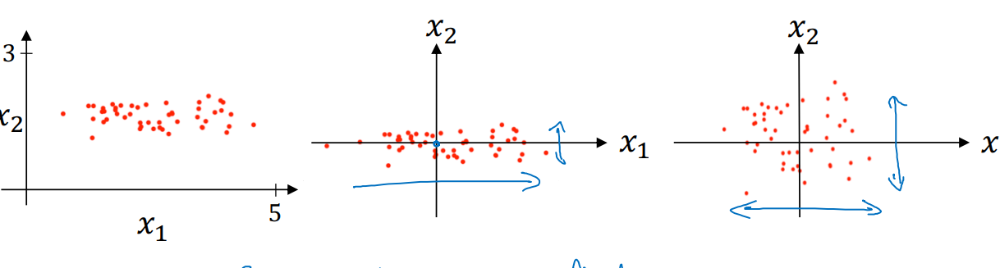

*** 

# Notes 23-07-24

## Week 1 Course 2

### Train/Dev/Test Set

* Deciding on the right parameter is an empirical process, and we will have to experiment with different values of hyperparameters to get the right results.
* Data is split into three parts: Training, Validation(dev) and test dataset. We train our model by optimizing hyperparameters based on the results of model on training and validation set and later we use test dataset to evalute the model
* If the size of dataset is less then we can consider 60/20/20 or 70/15/15 split, however for larger dataset percentage of validation and test dataset can be further reduced.
* However in the above distribution, the example in dev or the test dataset should be consistent or similar to the examples of training dataset.

***

### Bias and Variance

* A model which underfits the training data has a high bias( example using linear activations for non-linear data), whereas a model which overfits the training data is said to have a high varaince.

* A dataset which has a high training error and similar validation error is said to have high bias or it underfits the data. Note the to decide if a training error is high we should compare it with human error for same task
* A dataset having low training error but high validation error si said to have high varaince which means that it overfits the training data. Thus, the model does have a low training error but as it is not generalized well it has high validation error
* If a model has high training error and a even higher validation error than the model is said to have both high variance and high bias.

### Solution to High Bias or Variance

*  If a model has a high bias, then we can entire make a bigger NN or we can train for longer period or try some different NN architecture
* After solving the the bias issue, if the model has a high varaince than we can either use more data(which is sometimes not feasible or expensive) or use regularizations.

***
### Regularizations
#### L1 and L2 Regularization

*  L1 Regularization is defined as sum of all absolute values of W and L2 regularization is defined as sum of W sqaured, and L2 regularization is used moe oftenly.

* Adding this parameters penalizes model for large weights and makes some weights come closer to zero(depending on value of lambda) and make a simpler NN thus not overfitting the model.
* Reducing some weights to get them near zero and it's effect on overfitting can be understood from the tanh activation function, as when values are near zero it is roughly linear function thus making the model simpler and reducing overfitting.

***
#### Dropout Regularization
* Another regularization that can be used is dropout regularization which dropsout some weights on every iteration and it helps reduce overfitting because we are always then working with a smaller NN thus making model simpler and it's adavantageous when we know that some layer are overfitting we can set the probability of keeping it's weights to be low 
* Disadvantage of dropout regularization is that it cannot we cannot define J correctly and to resolve it we can set dropout to be off when calculating cost function.

***
#### Other Regularizations
* Data Augumentation method is used where for example we can flip an image or rotate it to get more data, or applying random distortions to digits/letter.
* Early stopping method plots both training and and validation error and picks the point where they both are vest (lowest together), however it is not encouraged to use as  it tries reducing cost function and overfitting together but it's preferable to do both processes seperately.

***
### Normalizing Inputs
* To increase training speed we can normalize the inputs by subtracting the mean of the dataset from the input and dividing it by it's variance. Normalizing input helps as then the cost function(if seen in 2d) looks more symmetric and optimization could be faster.

***
### Vanishing and Exploding Gradients
* When derivatives of parameters become very large/too small it is known as Exploding/Vanishing gradients and one of the solution that works partially is that we should be careful while randomly initializing weights such that the varaiance of these weights should be 1/n wehere n is number of weights(incoming) and for ReLU it should be 2/n.
***

 