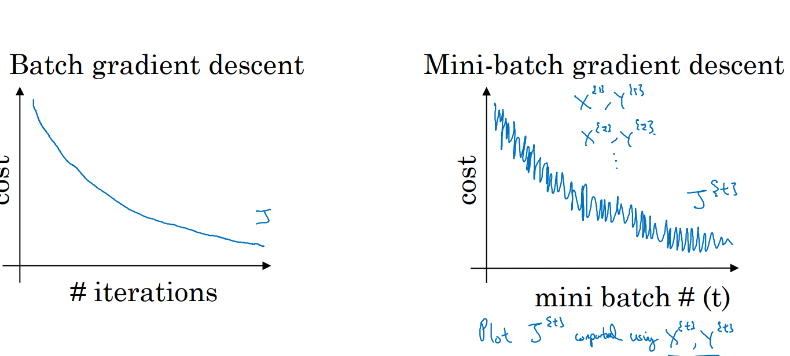
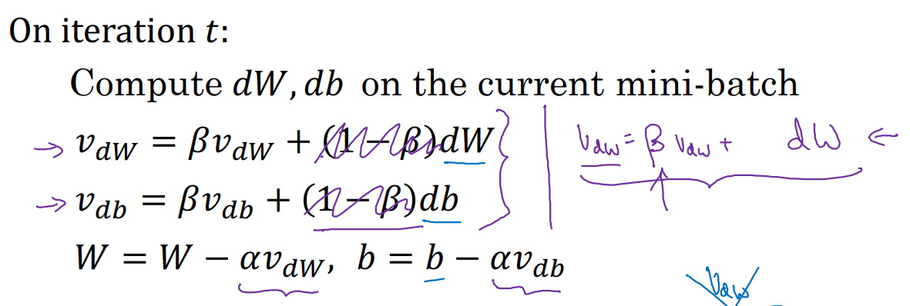
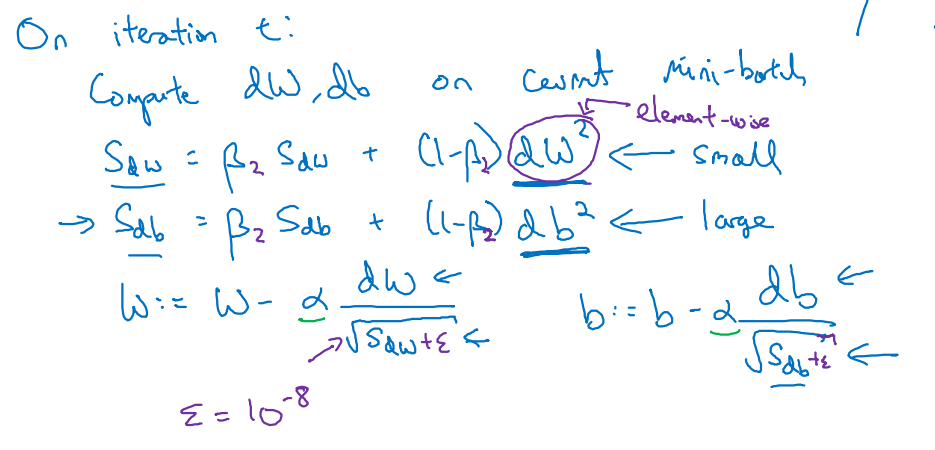
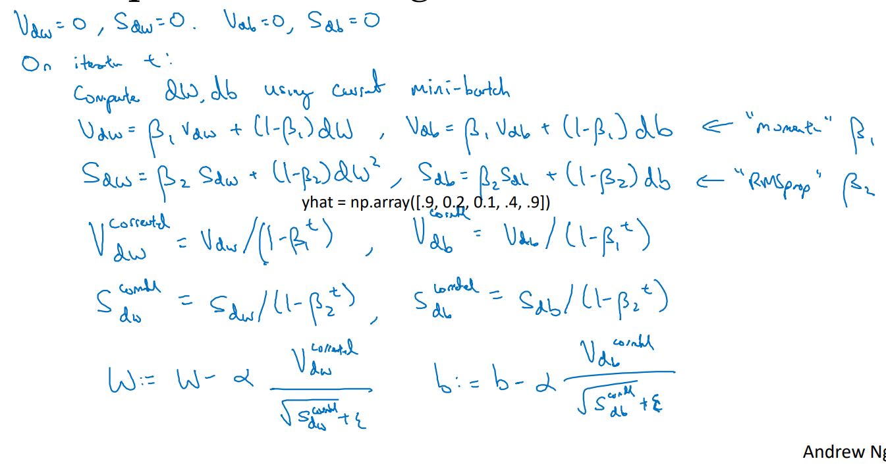
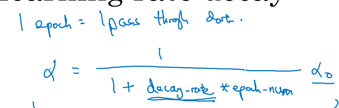
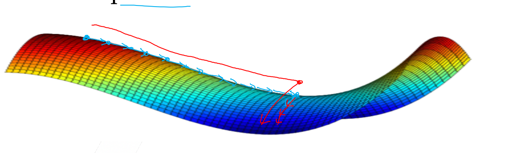

***
# Notes 24-07-24

## Week 2 Course 2

### Mini Batch Gradient Descent
 * Training a NN with large data is to slow, so to make it faster we can use mini batches by splitting X and Y into same number of batches and it would train our model faster.
* When we use mini batch gradient decsent, the cost function won't go down continously, it can be more noisy.

* Depending on the batch size there are few types of gradient descent methods, Batch  Gradient descent if the size of mini batch is same as number of training examples(m), Stochastic Gradient descent(SGD) if batch size is 1 and mini batch gradient descent if it is between 1 and m.
* If number of training examples is less than 2000 than we can use batch gradient descent other wise we should use mini batch gradient descent with size of batches in power of 2 for faster process.
***

### Exponentially Weighted Average

* If the dataset that we are working on is noisy, we can use exponentially weighted average which make skewed data points smooth by taking average of data points and makes gradient descent works faster.
* V(t) = beta * v(t-1) + (1-beta) * theta(t) is the general formula, however as v(0), it is not very accurate at the start therefore we introduce a term "bias correction" which converges to 1 with increase in t. Therefore, v(t) = (beta * v(t-1) + (1-beta) * theta(t)) / (1 - beta^t)
* We can implement Exponentially weighted average on gradient descent algorithm as well whcih helps minimizing cost function faster.

***
### RMSprop
* Another technique to perform gardient descent faster is using RMSprop which makes cost function move faster in direction of minima, we should ensure that in given formula sdw is not zero by adding some small value epsilon

***

### Adam optimization
* It stands for Adaptive Moment Estimation and it combines both Exponentially weighted average and RMSprop.

* The hyperparamter alpha is needed to tune with training dataset however beta1 has usally a value of 0.9 while beta2 has a value of 0.99 and epsilon 10^-8.

***
### Learning rate decay

* With help of this technique the learning rate is slowly decreases with iterations and it helps it reach the optimium point fadter because when the gradient descent is near optimum opint the steps should be relatively smaler.

***
### Local Optima and Plateaus
* Local optima is a point which is minimum in it's locality but it is not global minimum thus graadient descent algorithm stucks on reaching local optima however it is unlikely in large deep neural networks, which is more likely to just have saddle points.
*  The problems in deep NN, can be Plateaus as they are not having large slope the gradient descent takes much more time to reach to the optimum point, however optimization alogrithms can help here.
