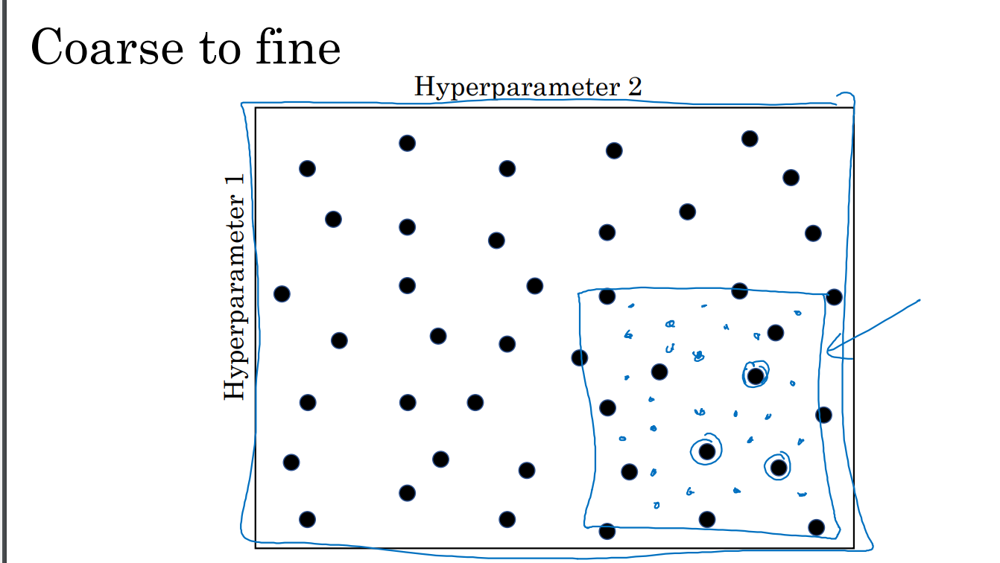
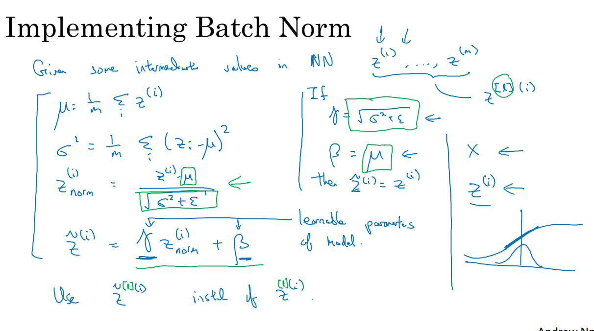
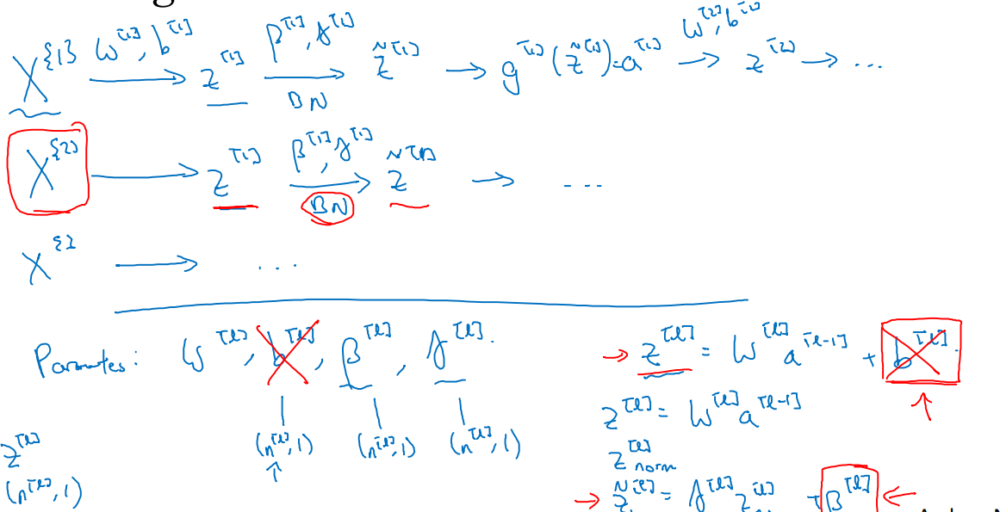
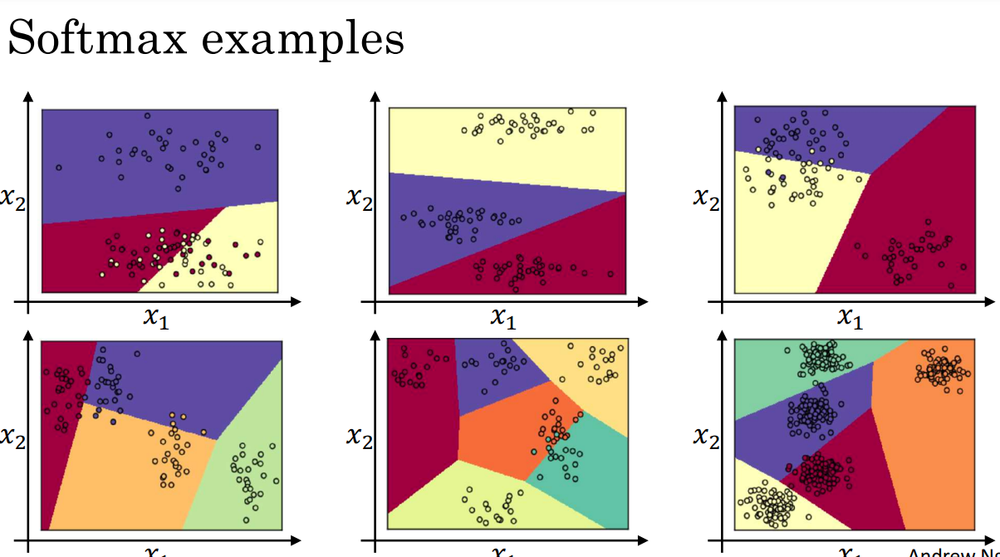

***
# Notes 25-07-24

## Week 3 Course 3

### Hyperparameter Tuning
* We need to find the right value of hyperparamteres by experimenting with different values. Learning rate, Beta, Mini Batch size, No of hidden units and no of input layers are few of the most important hyperparamters to tune(in the given order)
* To experiment with different values of hyperparameters you can form a grid of them and try combinations from that grid on the model, ensuring that these points are random so as to experiments with unqiue values everytime.
* We can also utlilze Coarse to fine technique in which after indentifying the region which gives us the best performance we zoom into that region and now experiments with more values.
  

* In practice, if we have less computational resources we can initilaize our hyperparameters to random values, and while observing the model every day, change the hyperparameters by small values to realize its effect, which is called Pandas approach
* If we have the computational resources , we can run some models in parallel with different hyperparameter and pick up the model with the best performance.

***
### Batch Normalization

* We have nomralized our input before and seen that if can reduce the training time of our model by getting more symmetric cost functions, so by similar logic we can train our parameters faster by nomralising the output of the previous layer. However, in practice we normalize Z insetead of A
 
* We can implement Batch Normalization on NN as well, using learnable parameters beta[l] and alpha[l] where beta is different form that used in RMSprop and ADAM. Also we can remove the bias(b) in definition of Z as we are already adding beta during normalisation

* Other than the normalizing effect, other reason which helps in greater performace from Batch Normalization is that doing this process adds some noise to Z and like dropout this has an regularization effect. However, still this process cannot replace regularization process.

***
### Softmax Regression
* We used logitstic Regression when it was binary classification, however if there exists more than 2 classes than we utilize Softmax Regression. Thus in this case Output layer will be a vector containing the probabilities of all the classes 'C'. 
* Thus the softmax function outputs a vector (unlike other activations) and the probabilities sum up to 1. The Softmax function can be stated as:  
t = e^(Z[L])                    
A[L] = e^(Z[L]) / sum(t)
* Similar to softmax function, hardmax also exists which assigns the value of 1 to the maximum probability and 0 to others. Also, if softmax function is implemented for 2 classes it is same as logistic regression. 
