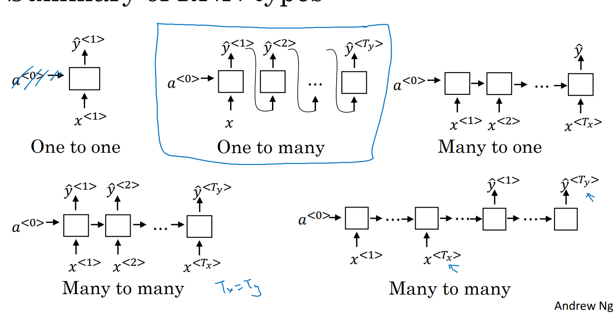
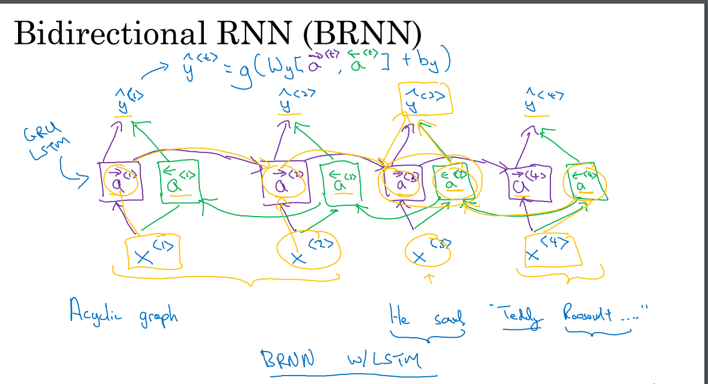

***

# Notes 28-07-24

## Week 1 Course 5

### Why are Sequence Models neede?
 Sometimes, learning from the sequences is important to do a particular task and thus RNNs and LSTMs have been some of the great models which have helped in Speech Recognition, Machine Translation, Sentiment Analysis and other such applications.

### Notations and RNNs
* One of the difficult task in field of NLP(Natural Language Processing) has been how to represents the words in numbers. One of the way to solve this problem could be use of dictionary, where every word has a partiular index.
* The size of this vocabulary list usually are between 30 thousand to 50 thousand however some bigger applications even have a vocabulary of size 100000. This list can be formed by identifying the 'm' most common words by travesing through our many examples. 
* We can thus represents the words in input using one hot encoding with the vocabulary and if an unkown word is encountered we can use a special token <'UNK'> representing unknown word
* We don't use NN for sequence tasks because of two reason.  
  * Input sequence can be of any length, as well as output sequence can be of any length. This problem can be solved by padding the input sequence to a maximum length
  * However, the more important problem is that in sequeunce tasks, differents results can inferred at different positions in input sequence but it is not possible to obtain them in simple NNs.
* The figure below represents RNN architecture where Wax and Way represents weights for the cativation functions however Waa represetns the memory of RNN.

* Usually, tanh and sigmoid activation functions are used to generate the output from each cell of RNN.
* For RNN, lost function is calculated by calculating Loss of individual timestamps and summing them to form the overall loss. Loss at the individual time stamp is calculated by using binary cross entropy loss function(used in logisitic regression)

* Some of the different types of RNN Architectures can be seen below. Some of the examples where theses architectures can be used includes: Music Generation for One to Many, Sentiment Analysis for many to one.
In Many to many there are two variants that can be used, if the output sequence is of different lengths then we can use the second varaint which has an enocder block and a decoder block.

***

### Language Modelling

* The task of Language Models is to give probability of what could be the next word in the sequence and RNN can be utilized to do such problems.
* For langauge modelling, we require large corpus of data. On this data then, tokenization is performed where <'UNK'> tells that this word does not exist in vocabulary and <'EOS'> tells that this end of sentence. 
* Now, using many to one architecture each cell is fed the correct input sequnce uptill that point and the output is the most probable word which is mostly calculated using softmax.
* After training the language modle we can check what our model has learned by sampling novel sequences. We must first pass the input, then it would randomly choose one of the predictions of language models to pass it to hte next cell of RNN.
* We can also perform character level tokenzaiton however it could be computationally more expensive and it would not be able to capture long term dependencies of the model.
***

### Problem with RNNs

* One of the major drawbacks of RNN is that it cannot capture long term dependencies. In long sequences for example it is more likely to do grammatical errors like identifying the right verbs based on the input. This problem is caused due to vanishing gradients.

***

### Gated Recurrent Unit(GRU)

* To solve the issue of long term dependencies we use Gated Recurrent Unit(GRU) which uses a new memory cell which gives information which can bes sotred from that particular sequence. Also, a update is used which decides if this information is to be kept or not is used. 

* In the given image, the first equation represents the candidate to replace memory cell, second represents the relevance cell and third represents the otuput cell.

***
### LSTM
* THey are similar to GRU but they have a update gate, forget gate and the output is an activation function applied to candidate cell variable.

***
### Deep RNNs and BRNNs

* Bidirectional RNNs allows to learn from both previous and futre context, as shown in figure to predict output the two activation cell repredenting learnings from left and right.

* Deep RNNs can constructed by stacking different RNN layers such that output of learning at one time step can be passed to another activation layer at the same time step

***
