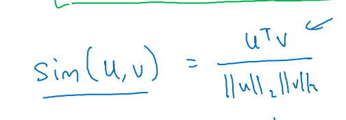
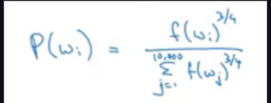
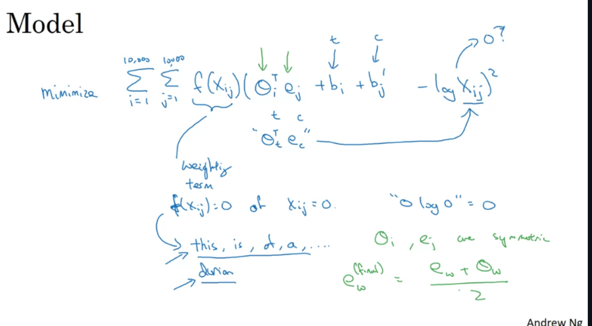

***
# Notes 31-07-24

## Week 2 Course 5

### Word Embeddings

* The main task of NLP has been representing words in numbers. Uptill now, we were using one hot encoding of the words to represent that in numbers. However, with this representation we are not able to represent analogies or similarites between two words. Thus, with word embeddings we can repesents the words along with the similarity.
* To form word embeddings, each word will have 300 features and thus this 300 dimensional vector will be used for representation. 
* Thus word embeddings help us tackle unlabeled with help of this representation and also reduces the vector size. It is able to represent analogies with the help similiarty functions like cosine similairty.

* If we have voacbulary of suppose 10000 words than we get the embedding matrix which is of dimension (300*10000).
* To form a model using this word embeddings we can either train it by using last few words, previous few words and next few words or just the last words. It is considered that if we want to train language model, we should use the first option.

***
### Skip Gram and Word2Vec

*  In this method we first slect a word 'context' and then randomly chosen within (say) +-10 words of given word. The Word2Vec model then yses softmax layer as the last layer, however calculating softmax for 10000 layers would be computationally expensive thus it uses Hierarchical softmax classifier

***
### Negative Sampling
* In negative sampling, we first select a context and the correct target for it, then we pick k random negative samples and then we train the model on this classifer which has 1 correct label and k incorrect label 
* The negative sample is taken according to the equation:

***
### GloVe Word Vectors
* Another technique used to form word evectors is GloVe which tries to measure how many times a given word occurs in context of another word usning the given formula:  

***
### Sentiement Classification
* Sentiment classification is the task of finding if a given review or sentence is positive, negative or neutral. One of it's main challenges include unavailability of large amount of labeled datasets however, with word embeddings and RNNs we can complete this tasks.
* However, one of the problem with Naive RNN and word embeddings would be even though the review or sentence might be containing words like 'good', etc however it can be negative review, Thus it is better to utilize a encoder block or have many to one architecture which performs best on sentiment analysis.

***
### Problems with Word Embeddings

* When forming word embeddings from large corpus of data, the embeddings might make undesirable gender, ethinicity bias. To solve this issue we need to idetify such pairs or example and equalize their distance from the two other embeddings that caused the issue.

****