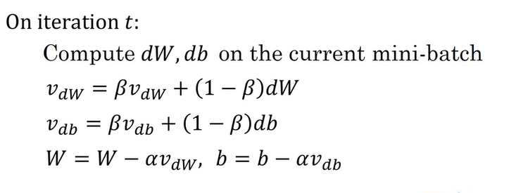
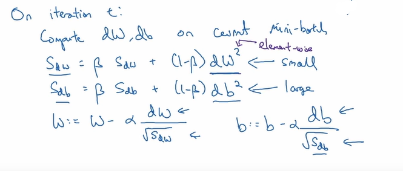
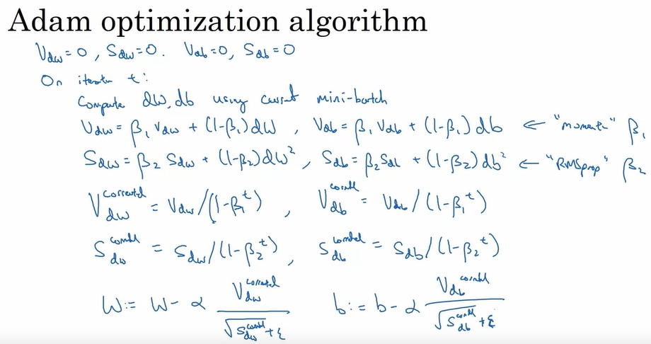
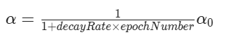

# COURSE 2

## WEEK 1  

---  

**Train/Dev/Test Sets**  
Train set -> used for training the model
Dev set -> used for development. to tune the hyperparameters
Test set -> test the final model

general proportion 60/20/20
in practice, 99+/0.5/0.5 is much preferred
test set is optional  

**Bias/Variance**  
high bias -> model underfits. the model is trained on less details. both train set and dev set errors are high  
reduce high bias by making a larger nn.  

high variance -> model overfits. the model is trained on more details. dev set error is much higher than train set  
reduce high variance by having a larger dataset, if not possible use regularisation.

**Normalization**  

Normalization of data is to arrange the data to be centred around zero, and have almost similar range across all its parameters. this is done to make the curve of the cost function even, making it easier for gradient descent.
the mean is subtracted from each input feature to make it centred around zero, and the standard deviation is divided from each input feature to make it equally distributed. (mean = 0 and variance = 1)  

**Regularisation**  

Regularization is a technique used in machine learning to prevent overfitting and improve the generalization of a model. When a model is overfitting, it means that it is too complex and has learned to fit the training data too closely, resulting in poor performance on new, unseen data.

Regularization helps to address this issue by adding a penalty term to the loss function during training. This penalty term discourages the model from assigning too much importance to certain features or parameters, making the model more generalized and less prone to overfitting.

There are different types of regularization techniques, but the most common one is called L2 regularization or weight decay. In L2 regularization, the penalty term is proportional to the square of the weights of the model. By adding this term to the loss function, the model is encouraged to keep the weights small, which helps to prevent overfitting.

Regularization is an important concept in machine learning and is widely used in various algorithms, including neural networks. It is often combined with other techniques such as hyperparameter tuning and optimization to improve the performance of models.

**Dropout Regularization**  

Dropout regularization is a powerful technique used in deep learning to prevent overfitting. Here is a summary of dropout regularization:  

1. Dropout is a regularization technique that randomly sets a fraction of the input units to 0 at each training step. This helps to prevent the neural network from relying too heavily on any single input feature.

2. The dropout technique involves going through each layer of the network and setting a probability of eliminating a node. For example, a probability of 0.5 means that there is a 50% chance of keeping each node and a 50% chance of removing it.

3. By randomly dropping out nodes during training, dropout creates a smaller, diminished network. This forces the network to learn more robust and generalizable features.

4. During training, each training example is trained using a different set of nodes that are kept or dropped out. This randomness helps to regularize the network and prevent overfitting.

5. Inverted dropout is the most common implementation of dropout. It involves generating a random matrix and multiplying it element-wise with the activations of the layer. This effectively zeros out a fraction of the activations.

6. At test time, dropout is not used. The network makes predictions without dropout to avoid adding noise to the predictions.

7. Dropout regularization helps to improve the generalization of the neural network by reducing overfitting and improving its ability to generalize to unseen data.

as such any node will not be sensitive towards a particular node, since it can get eliminated any time. hence this would simplify the training process and reduce overfitting

**Other methods**  

The first technique is data augmentation, which involves adding variations of existing training examples to the dataset. For example, flipping an image horizontally or taking random crops of the image. This can help increase the size of the training set and reduce overfitting.

The second technique is early stopping, where the training process is stopped before convergence based on the performance on a validation set. By stopping early, the neural network parameters are kept at a smaller size, similar to L2 regularization, which can help reduce overfitting.

**Vanishing/exploding gradients problem**  

if theres a large NN with many hidden layers, if the weights use are more than 1 then they get multiplied every time the data moves from one function to the other, making them increase exponentially. similarly if it is less, they will decrease logarithmcly. as such the end data is either exploded or becomes vanished to 0. this was a problem faced while training deep neural nets before, but now is fixed by many techniques like He's method of weight initialisation

1. Initialization for a single neuron: We start by considering the initialization of weights for a single neuron. The goal is to prevent the activation values from becoming too large or too small. One approach is to set the variance of the weights to be 1/n, where n is the number of input features. This helps to keep the sum of the weighted inputs within a reasonable range.

2. Generalizing to deep networks: We then extend this initialization approach to deep neural networks. Each layer in the network has its own weight matrix, and the variance of the weights is set based on the number of input features for that layer. For ReLU activation functions, it is often better to set the variance to 2/n.

3. Variants for different activation functions: Different activation functions may require different initialization approaches. For example, if the TanH activation function is used, the variance should be set to 1/n. This is known as Xavier initialization. Another variant, suggested by Yoshua Bengio and colleagues, uses a different formula.

4. Importance of weight initialization: Proper weight initialization helps to mitigate the problems of vanishing and exploding gradients. By setting the weights to an appropriate scale, we can prevent them from decaying to zero or growing too quickly during training.

5. Hyperparameter tuning: The recommended initialization formulas provide a starting point, but the variance parameter can be tuned as a hyperparameter. However, tuning this parameter is usually not as critical as other hyperparameters in the network.

6. Benefits of careful weight initialization: By using appropriate weight initialization techniques, we can train deep neural networks more effectively and avoid issues with exploding or vanishing gradients. This leads to faster and more stable training.

**Gradient Checking**  

Gradient checking is a technique used to verify the correctness of the implementation of backpropagation in deep neural networks. It helps in debugging and finding bugs in the implementation. Here is a summary of gradient checking and its notes:

1. Gradient checking involves comparing the gradients computed using backpropagation with the gradients computed using a numerical approximation.
2. The first step in gradient checking is to reshape all the parameters of the network into a giant vector called theta.
3. The cost function J, which is a function of the parameters W and B, is then expressed as a function of theta.
4. The derivatives dW and dB are reshaped into a giant vector called d theta, which has the same dimension as theta.
5. To implement gradient checking, a loop is used to compute d theta approx i for each component of theta.
6. d theta approx i is computed by taking a two-sided difference of J with respect to theta i, by nudging theta i by epsilon.
7. The two vectors, d theta approx and d theta, are compared to check if they are approximately equal.
8. The distance between the two vectors is computed using the Euclidean distance formula.
9. A small value indicates that the derivative approximation is likely correct, while a larger value suggests a bug in the implementation.
10. Epsilon is typically set to 10^-7 for gradient checking.
11. If the gradient check fails, it indicates that there might be a bug in the derivative computations.
12. Debugging is required to identify the specific component of theta where the difference between d theta approx and d theta is large.
13. Once the gradient check passes with a small value, it provides confidence that the implementation is correct.

**END OF WEEK1**

## WEEK2

---

**Mini Batch Gradient Descent**  

instead of applying gradient descent on the entire training set and propogating through the entire set for each time you perform gradient descent, we create batches of data called epochs, and then perform gradient descent in these mini batches. this is called mini batch gradient descent. batch gradient descent is when the size of the mini batch equals to the size of the training set, i.e. iterating through the entire data. these epochs are ranged between 64 and 512, in powers of two. iterating through these epoches we find the optimal parameters for one epoch, and use them for the next and optimise them again, and so on till it reaches the last epoch.

**Exponentially weighted averages**  

ewa is used to compute the the trends of the moving averages. it uses collection of past data, say 10 days or 50 days and add the current ones to create a graph in accordance with the trend. this removes the noise in the data and evens out the data graph  

Vt = (beta)\*v(t-1) + (1-beta)\*data(t)  

bias correction: the graph will start from 0 and slwly move upwards to meet the expected graph, but we dont want this unneccasry bias. hence there is  abias correction added. vt is divided by (1 - beta ^t). this would be significant during the earlier values of t but would then fade over as beta < 1. hence the bias generated during the initial t phase gets corrected.  

**Gradient descent with momentum**

instead of the normal gradient descent, we incorporate the principles of exponentially weighted averages.   

this is how we update the parameters

**RMSprop**

rms prop is just like gradient descent with momentum but uses the squares of the data (ie dW and db)  
here is the implementation  
  

In gradient descent with momentum, the update rule for the parameters includes a momentum term that accumulates a fraction of the previous gradients. This helps to smooth out the updates and accelerate convergence. On the other hand, RMSprop uses a different update rule that adapts the learning rate based on the magnitude of the gradients. Gradient descent with momentum does not adapt the learning rate based on the magnitude of the gradients. It uses a fixed learning rate and adjusts the updates based on the accumulated momentum. In contrast, RMSprop adapts the learning rate for each parameter individually based on the magnitude of the gradients. It divides the learning rate by the square root of the exponentially weighted average of the squared gradients.  

**Adam Optimization algorithm**  

adam algo is basically using both gradient descent with momentum and rmsprop. here is the flow:  
  

note that the epsilon term in the denominator is a small value used as a buffer incase the denominator becomes zero.

adam algo helps the model train quickly, being a powerful algo for gradient descent.  

**Learning rate decay**  

as much as the parameters attain their minima by gradient descent it is essential to minimise the learning rate, as it is already approaching the minima and we dont want it to create noise around the minima or bypass it. as such a formula is devised to update the learning rate parameter.  
  

**END OF WEEK2**

## WEEK 3
---
